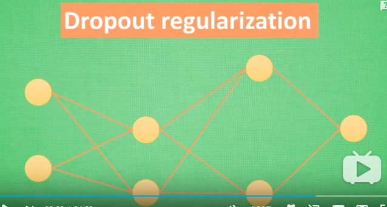

# Tensorflow

## [1. Tensorflow 搭建自己的神经网络 (莫烦 Python 教程)](https://www.bilibili.com/video/av16001891?from=search&seid=15789399425031977581)

### [1.1 基于机器学习的数字识别](http://wiki.jikexueyuan.com/project/tensorflow-zh/tutorials/mnist_beginners.html)

### 1.2 过拟合解决方法
- 增加数据量
- 正则化初始数据
- 惩罚机制 

- dropout 

## 2.《Tensorflow实战  黄文坚》
